# Sistema de Gerenciamento de Estoque

Sistema Desenvolvido para o teste da empresa Comuniverse

# Tecnologias

- React e Typescript
- Laravel e Php
- Mysql

# Como rodar o projeto

## Clonando o Projeto

Execute os comandos no seu terminal

```bash
git clone https://github.com/gustavors22/stock-management.git
```

```bash
cd stock-management
```

## Configurando e Executando o Back-end

Na raiz do projeto haverá duas pastas. Dentre elas: uma pasta do backend e outra do frontend.

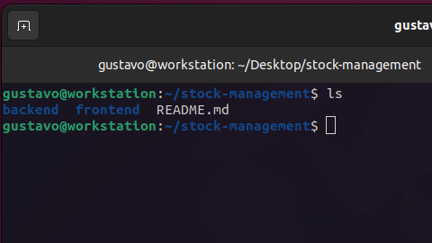

Entre dentro da pasta "backend" e execute os seguintes passos:

```
cd backend
```

1. instalando dependências:

```bash
composer install
```

2. Abra a pasta backend com seu editor de código.
3. Crie um arquivo ".env" e cole o conteúdo do arquivo ".env.example" dentro.

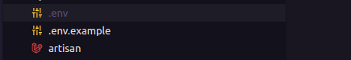

4. Criei um banco de dados mysql.

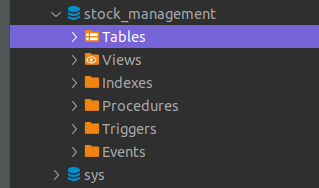

5. Coloque as informações do seu banco de dados nos seus respectivos campos no arquivo ".env"

```
DB_CONNECTION=mysql // SGBD
DB_HOST=127.0.0.1 // IP do seu SGBD
DB_PORT=3306 // porta que seu banco está rodando
DB_DATABASE=stock_management // nome do banco dados criado
DB_USERNAME=root // usuário de conexão do banco
DB_PASSWORD=root // senha de conexão do banco (caso não tenha senha deixe em branco)
```

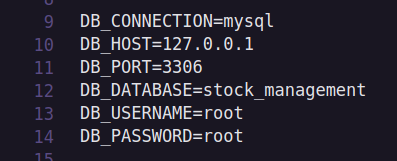

6. Execute o seguinte comando para executar a migrations

```bash
php artisan migrate
```

Após executar o comando acima, deverá ter o seguinte resultado

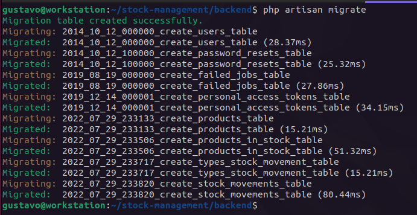

7. Execute o seguinte comando para popular o banco com alguns dados

```
php artisan db:seed
```

Após executar o comando acima, deverá ter o seguinte resultado


8. Execute o comando para finalmente ter o backend rodando

```
php artisan serve
```

Após executar o comando acima, deverá ter o seguinte resultado


### Rodando o Frontend

1. Entre na pasta do frontend localizada na raiz do projeto

2. Execute o seguite comando para instalar dependências

```
npm install
```

ou

```
yarn
```


3. rodando o frontend

```
npm run dev
```

ou

```
yarn dev
```

## Overview do projeto:

### Página de produtos

Nesta página será possível gerenciar os produtos

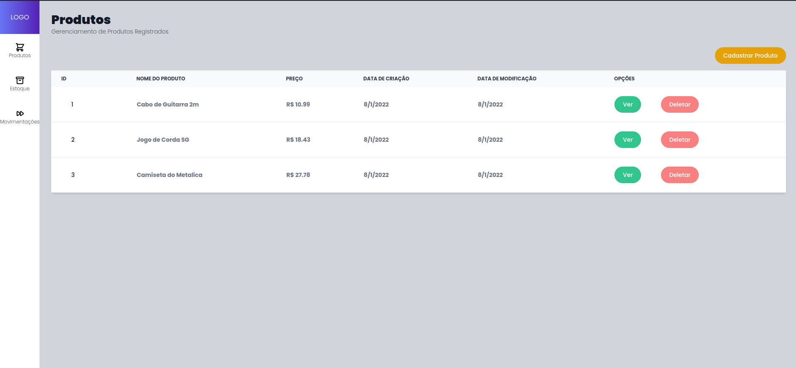

Ao Clicar no botão de cadastrar produto, irá abrir um modal para inserir os dados do produto que queira cadastrar.

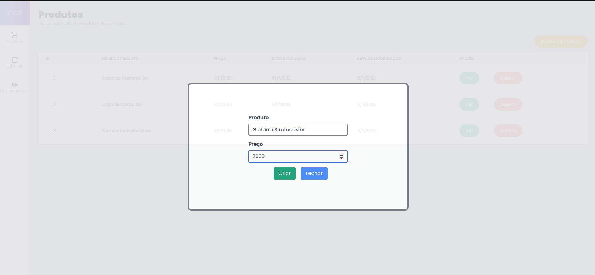

Na tabela existe dois botões no qual consistem em: abrir o modal de visualizar um produto e excluir.

Clicando no botão de visualizar sera aberto um modal com as informaçoes.

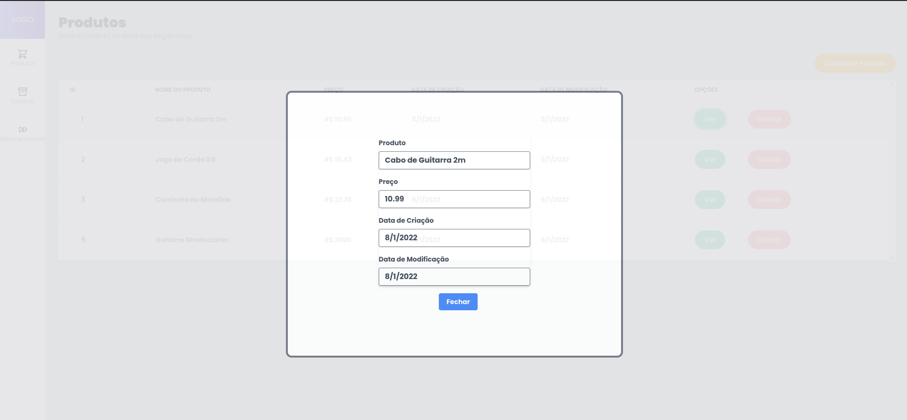

### Página de Estoque de Produtos

Nesta página será possível gerenciar os estoques de produtos.

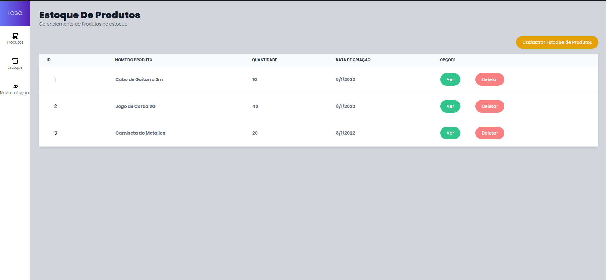

Ao Clicar no botão de cadastrar estoque de produto, irá abrir um modal para inserir os dados selecionar um produto e quantidade inicial que terá no estoque do respectivo produto.

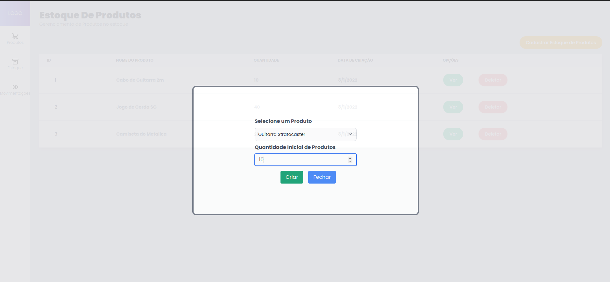

Na tabela existe dois botões no qual consistem em: abrir o modal de visualizar um estoque e um botão de excluir o mesmo.

Clicando no botão de visualizar sera aberto um modal com as informaçoes.

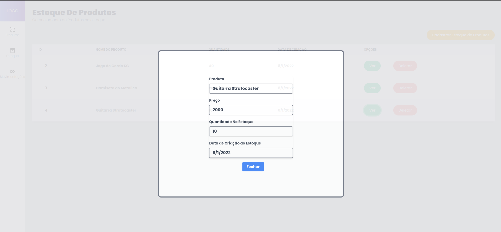

### Página de Movimentação de Estoque

Nesta página será possível gerenciar as movimentações de estoques.

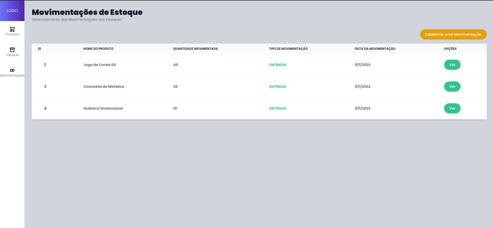

Ao Clicar no botão de cadastrar uma movimentação, irá abrir um modal para inserir os dados selecionar um produto e quantidade que será movimentada no estoque do respectivo produto.

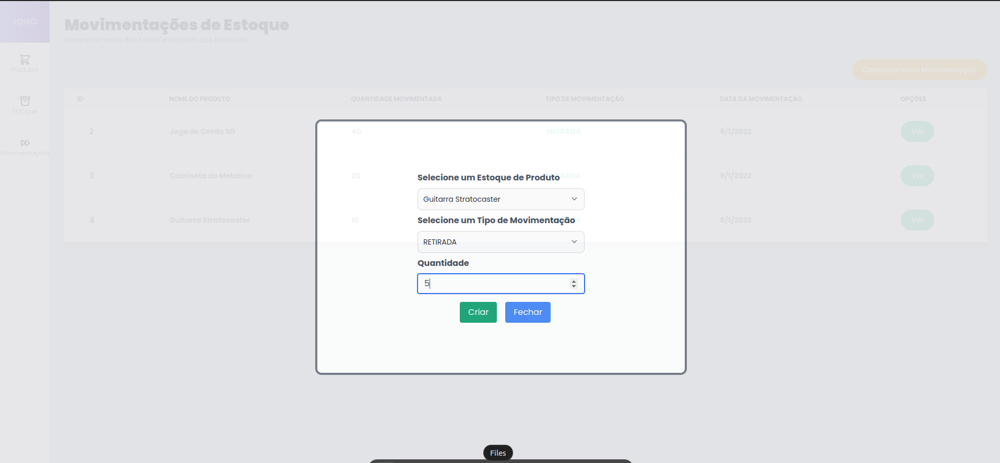

Caso selecione o tipo de movimentação como "RETIRADA" irá ser subtraído no estoque a quantidade movimentada. Caso contrário, irá ser somada a quantidade do estoque com a quantidade movimentada.

Após fazer o movimentação será possível ver que a quantidade no stoque foi alterada

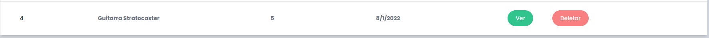
